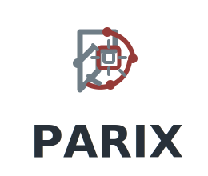

<p align="center">
  
</p>

# 🧠 Parix

> **The Proactive, Local-First Self-Healing Workstation Agent**

Parix is a state-of-the-art, polyglot AI assistant designed for proactive OS automation and self-healing workspace support. Running seamlessly as a background workstation service, it actively monitors terminal execution, logs, and development activity to detect errors, repeated build failures, and environmental anomalies. Using its stateful planning system, Parix diagnoses root causes and proposes or executes instant, one-click repairs before you even have to ask.

### 🌟 Key Pillars
- **Proactive Self-Healing**: Automatically intercepts shell errors, analyzes failure outputs, and plans multi-step fixes.
- **Local-First & Private**: Keeps all your proprietary code, session context, and workspace logs strictly on your local machine, utilizing local fallback models to guarantee privacy.
- **Hybrid Cognitive Architecture**: Powered by a high-level **Node.js Brain** (Atrium) for advanced planning and scheduling, combined with low-level **Python Hands** for platform-specific OS sensors and automation.
- **Real-Time Visual Control**: Equipped with a beautiful, responsive **Vite + React Dashboard** (Aegis) to inspect active plan trees, view execution logs, run system diagnostics, and interact with the agent.

---

## ⚡ Quickstart & One-Line Installers

Parix runs on **Windows, macOS, Linux, and WSL2** — install on whichever you prefer. The frictionless one-line installers verify your machine's preflight requirements (Node.js 20+, Python 3.12+, Git), clone the official Parix repository, install all dependencies, build the project workspaces, and instantly launch the **Hatchery interactive onboarding flow** to configure your API keys, channels, and privacy choices.

### 🪟 Windows (PowerShell)
Execute the following in PowerShell:
```powershell
powershell -ExecutionPolicy Bypass -c "irm https://raw.githubusercontent.com/suhas12345685-pro/Parix/main/install.ps1 | iex"
```

### 🍎 macOS (Bash/Zsh)
Execute the following in Terminal:
```bash
curl -fsSL https://raw.githubusercontent.com/suhas12345685-pro/Parix/main/install.sh | bash
```

### 🐧 Linux (Bash)
Execute the following in Terminal:
```bash
curl -fsSL https://raw.githubusercontent.com/suhas12345685-pro/Parix/main/install.sh | bash
```

### 🐧🪟 WSL2 (Windows Subsystem for Linux)
The same Linux installer works inside WSL2 — it auto-detects WSL and installs the Linux build:
```bash
curl -fsSL https://raw.githubusercontent.com/suhas12345685-pro/Parix/main/install.sh | bash
```
> **Note:** Inside WSL2, the **headless agent works fully** — sensors, messaging channels, CLI tasks, cron, and proactiveness. But **on-screen control (the operator / Windows UIAutomation) and native desktop notifications do not work inside WSL2**, because they are Windows-native. For full screen-operation, install natively on Windows with the PowerShell command above.

---

## 🚀 Runtime Operations

Once Hatchery completes the onboarding sequence, Parix runs seamlessly as a background process.

### Desktop Command Line Utility
Reopen your terminal or shell to reload your system path and utilize the standard `parix` CLI tools:

```bash
parix start         # Starts Atrium, Hands, and Aegis background services
parix status        # Checks current status of all background components
parix stop          # Stops the background services cleanly
parix restart       # Restarts all active agent processes
parix onboarding    # Runs Hatchery again to modify credentials or configurations
```

### 💬 Interactive Console Actions
Inside the **Aegis Voice & Chat interface**, you can run commands directly:
*   `stop parix` / `resume parix`
*   `status`
*   `flush queue` (clears pending self-healing task runs)
*   `start parix atrium` (fires up the Brain independently)

---

## 🏗️ System Architecture

Parix separates reasoning (Brain) and action (Sensors & Execution) into dedicated processes connected via the typed **Synapse WebSocket Bridge**:

```text
       ┌────────────────────────┐
       │   User / Workstation   │
       └───────────┬────────────┘
                   │
                   ▼
       ┌────────────────────────┐
       │ Hatchery Onboarding    │ ───► profile.json + secrets + scope
       └───────────┬────────────┘
                   │
                   ▼
   ┌────────────────────────────────┐       ┌────────────────────────┐
   │ Aegis Dashboard (React UI)     │ ◄───► │ Atrium Brain (Node.js) │
   │ Local Port 3000                │  WS   │ Local Port 8766        │
   └────────────────────────────────┘       └───────────┬────────────┘
                                                        │
                                                     Synapse
                                                    WS (8765)
                                                        │
                                                        ▼
   ┌────────────────────────────────┐       ┌────────────────────────┐
   │ SQLite / memory.db database    │ ◄──── │ Hands Sensors (Python) │
   └────────────────────────────────┘       │ CLI, Accessibility, OS │
                                            └────────────────────────┘
```

### Main Directories
*   [`atrium/`](file:///C:/Users/DELL/.gemini/antigravity/worktrees/parix/add-greeting-feature/atrium) — TypeScript core engine containing the Council state machine, LLM routing, scheduling, priority dead-letter queues, and fallback channels.
*   [`hands/`](file:///C:/Users/DELL/.gemini/antigravity/worktrees/parix/add-greeting-feature/hands) — Python platform executor and sensor loop, utilizing OS sensors, Accessibility API integrations, and safe command runners.
*   [`aegis/`](file:///C:/Users/DELL/.gemini/antigravity/worktrees/parix/add-greeting-feature/aegis) — Responsive Vite + React frontend dashboard to monitor agent status, logs, cron jobs, settings, and skills.
*   [`hatchery/`](file:///C:/Users/DELL/.gemini/antigravity/worktrees/parix/add-greeting-feature/hatchery) — Interactive wizard to guide fresh installations step-by-step.
*   [`shared/`](file:///C:/Users/DELL/.gemini/antigravity/worktrees/parix/add-greeting-feature/shared) — Single source of truth schemas, WebSocket protocol contracts, and database DDL.

---

## 👁️ Hybrid Accessibility + Vision Layer

Parix’s technical moat lies in its ability to read the workstation screen across multiple platforms:

| Target Platform | Native API | Backup Driver | Spatial Understanding |
| :--- | :--- | :--- | :--- |
| **Windows** | UIAutomation (`pywinauto`) | Screenshots + Local OCR | Yes |
| **macOS** | AXUIElement API (`pyobjc`) | Screenshots + Local OCR | Yes |
| **Linux** | AT-SPI2 / D-Bus (`pyatspi`) | Screenshots + Local OCR | Yes |

*When native UI entropy is too low, the system automatically uses visual OCR (`mss` screenshot fallback) and merges them into a single, unified `AccessibilitySnapshot` for rich, layout-aware AI reasoning.*

---

## 🧠 Cognitive Framework & Autonomy

Parix processes environmental inputs through a robust stateful cognition loop to filter noise and safely resolve errors:

```text
Event Source ──► Debouncer/Attention ──► Desire State ──► Planner (DAG) ──► Validation ──► Execution
```

1.  **State Machine (The Council)**: Steps securely between `IDLE ──► OBSERVING ──► THINKING ──► ACTING ──► WAITING`.
2.  **Safety First**:
    *   Any terminal action requires explicit user permission via **Telegram/Desktop alerts** or a click in **Aegis**.
    *   Supports a **Pause Switch hotkey** (`Ctrl + Shift + P`) to immediately suspend all background sensory collection.
3.  **Local Memory (SQLite)**: Stores episodic history, profile facts, active workflows, and system health status. If a background component crashes, it performs a zero-loss `REBOOT_SYNC` push to restore the state.

---

## 🛠️ Developer Setup & Verification

If you are setting up a development workspace to customize or extend Parix:

### 1. Manual Setup
```bash
# Clone the repository
git clone https://github.com/suhas12345685-pro/Parix.git
cd Parix

# Install Workspace Node packages
npm install

# Setup Python environment and requirements
python -m pip install -r hands/requirements.txt
python -m pip install -r hands/requirements-dev.txt

# Run Onboarding and build
npm run onboarding
```

### 2. Running in Development Mode
Launch components in separate shells to watch local log files and test edits:
```bash
# Start Hands WebSocket server
python -m hands.main

# Run Atrium brain compilation and watch
npm run dev --workspace=atrium

# Start Aegis local server
cd aegis
npx vite dev --host 127.0.0.1
```

### 3. Quick Shipping Gate Verification
Verify local builds, types, test suites, and skill schemas prior to push:
```bash
npm run verify:ship
```

---

## 🔑 Environment Configuration

Copy `.env.example` to `.env` and fill the variables for your preferred integrations:
*   `GEMINI_API_KEY`, `OPENAI_API_KEY`, `ANTHROPIC_API_KEY`, `GROQ_API_KEY` (Cloud reasoning engines)
*   `OLLAMA_BASE_URL`, `LMSTUDIO_BASE_URL` (Local privacy fallback engines)
*   `TELEGRAM_BOT_TOKEN`, `TELEGRAM_CHAT_ID` (Mobile self-healing controls)
*   `HANDS_WS_URL` (Synapse WebSocket bridge destination; defaults to `ws://localhost:8765`)

---

## 📄 License & Terms

Parix is open-source software licensed under the MIT License. It operates locally and values user data privacy by executing code directly on your local workstation without external telemetry streaming. Check [`SOUL.md`](file:///C:/Users/DELL/.gemini/antigravity/worktrees/parix/add-greeting-feature/SOUL.md) for core principles.
